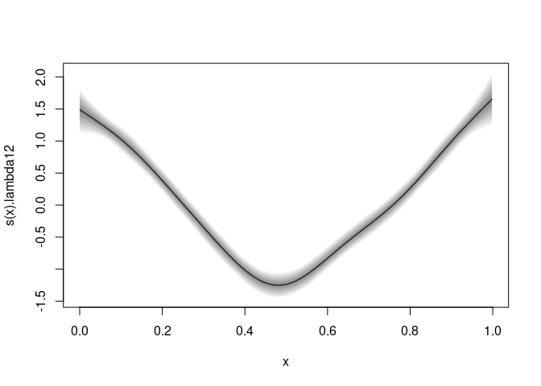

bamlssMVN
=========

[**BAMLSS**](http://www.bamlss.org/) families for modelling multivariate
normal distributions reparameterized using the (modified) Cholesky
decomposition of the covariance matrix.

Installation
------------

This package is hosted on the gitlab server of the Universitaet
Innsbruck. The repository has public access.

-   You can either install it directly on your system by using
    [**devtools**](https://devtools.r-lib.org/) in an R session:

<!-- -->

    devtools::install_git("https://git.uibk.ac.at/c4031039/bamlss_mvn")

-   Or clone it using [git](https://git-scm.com/) and a git client for
    your system. And build and INSTALL it after cloning, e.g. in a bash:

<!-- -->

    git clone https://git.uibk.ac.at/c4031039/bamlss_mvn.git
    R CMD build bamlss_mvn
    R CMD INSTALL bamlssMVN_0.1.3.tar.gz

-   Or download the source code as tarball
    [bamlss\_mvn-master.tar.gz](https://git.uibk.ac.at/c4031039/bamlss_mvn/-/archive/master/bamlss_mvn-master.tar.gz).
    Here, you also have to build and INSTALL the package after the
    download.

First Model
-----------

    library(bamlss)
    library(bamlssMVN)
    data(simdata)
    d <- simdata$d
    f <- make_formula(y1 | y2 | y3 ~ s(x) | s(x) | s(x))
    b <- bamlss(f, family = mvnchol_bamlss(k = 3), data = d)

    ## AICc 9422.284 logPost -4839.99 logLik -4648.88 edf 60.349 eps 0.0000 iteration  11
    ## elapsed time:  4.25sec
    ## Starting the sampler...
    ## |********************| 100%  0.00sec  1.35min

    plot(b, model = "lambda12")

